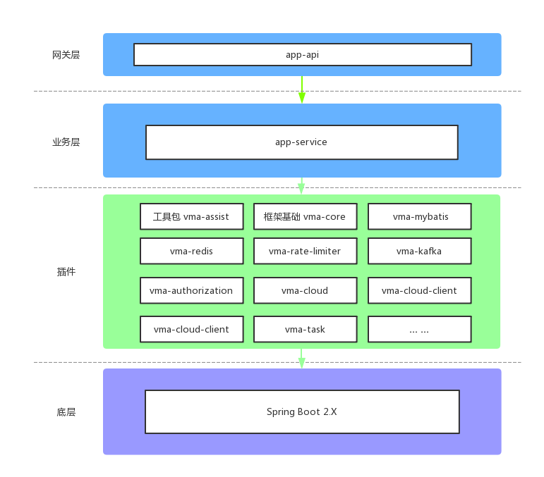
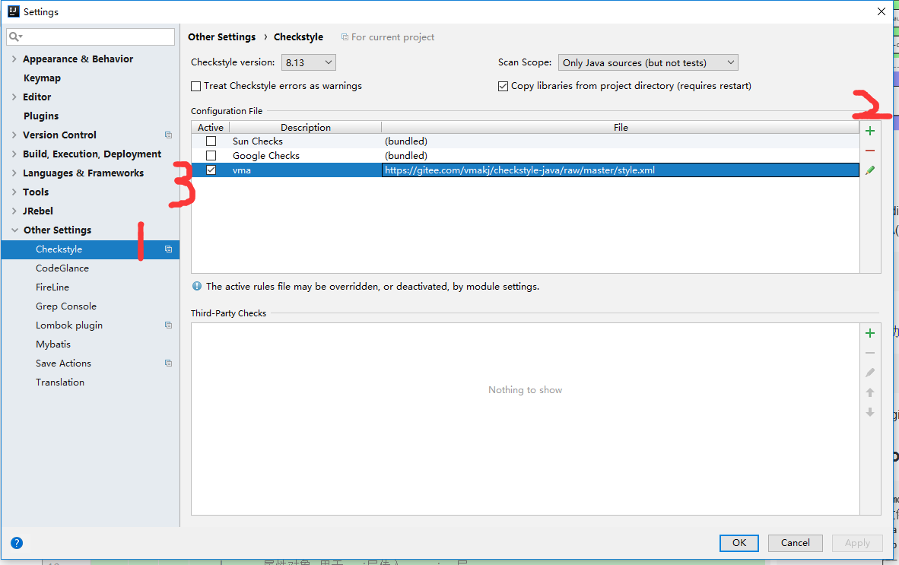
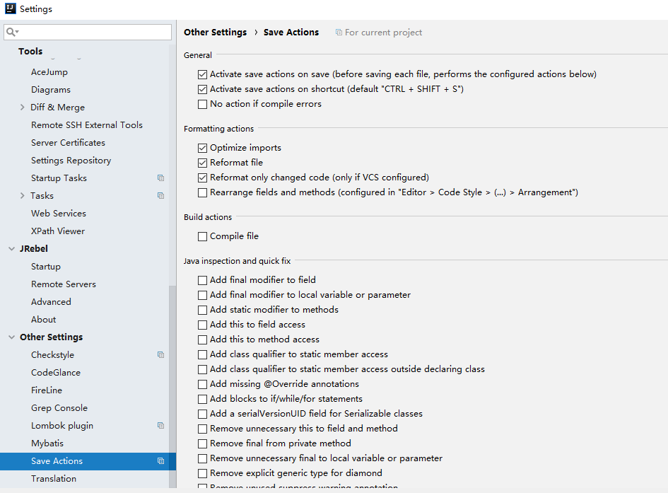

# 微码服务端框架
### 系统架构图


### 开发环境
> JDK 1.8+   
> IDEA开发工具  
> Maven setting文件在项目files文件夹下

### IDEA插件要求
+ Alibaba Java Coding Guidelines(阿里巴巴代码规范提示)
+ CheckStyle-IDEA(代码规范检测)
> 每个项目都要单独设置  
> 配置文件在项目files文件夹下
>
+ Lombok plugin
+ Save Actions(自动保存)
>每个项目都要单独设置
>
+ Free Mybatis plugin(推荐)
+ JRebel(推荐,热部署)


###  使用Spring Boot 项目结构描述

```shell
├──vma-boot-app-demo 对外提供接口
    ├── java java文件
        └── com.vma
            └── app
                ├── config 模块的配置
                ├── controller 控制器,程序请求统一入口
                ├── dto request 参数接口实体
            └── Application.java  app启动入口
    └── resources 配置文件资源
        ├── config  相关配置文件
            ├── application.yml 公共配置文件
            ├── application-development.yml 开发环境独有配置文件
            ├── application-production.yml 生产环境独有配置文件
            ├── application-test.yml 测试环境独有配置文件
        └── logback-spring.xml logback日志配置文件,指定日志滚动策略,级别等.
├──vma-boot-service 业务处理
    ├── java java文件
        └── com.vma.business
            └── dao DAO接口
            └── domain 
                └──bo 业务对象 用于返回给接口
                └──vo 属性对象 用于api层传入service层
            └── entity  与数据库对应的实体
            └── service service接口
                └──impl service实现类
            └── utils 工具类
            └── ApplicationEnvironListener.java  service事件监听器
        └── resources 配置文件资源
            ├── mapper  mybatis sql语句文件
            └── application-service.yml service默认配置文件
├──vma-boot-task 定时器模块 按需添加
    ├── java java文件
        └── com.vma
            └── task
                ├── config 模块的配置
                ├── task 定时器任务
            └── VmaTask.java  task启动入口
        └── resources 配置文件资源
            ├── application.yml 公共配置文件
            ├── application-development.yml 开发环境独有配置文件
            ├── application-production.yml 生产环境独有配置文件
            ├── application-test.yml 测试环境独有配置文件
            └── logback-spring.xml logback日志配置文件,指定日志滚动策略,级别等.
```